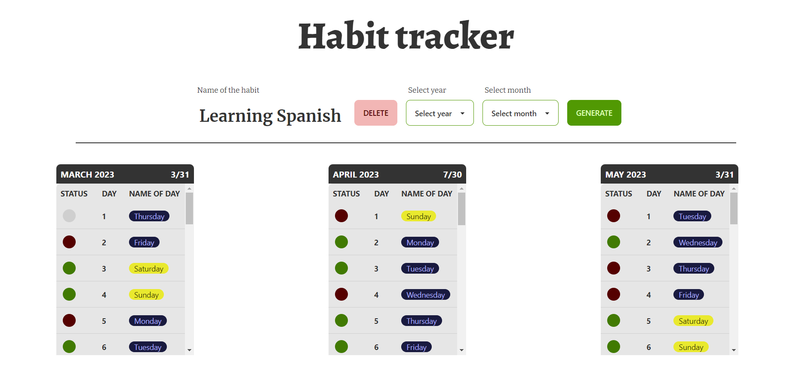
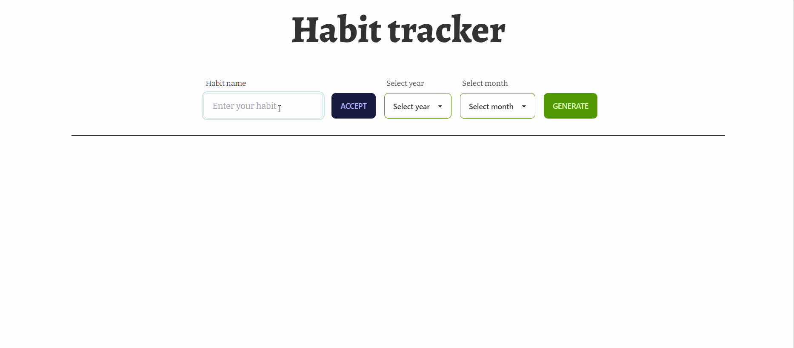

<div align="center">
<h1 align="center">Habit Tracker</h1></div>



## Table of contents

* [General info](#general-info)
* [Demo](#demo)
* [Getting Started](#getting-started)
* [How to Use](#how-to-use)
* [Contact](#contact)

## General info

Habit Tracker is an application written in JavaScript using TailWindCSS and daisyUI components for styling. The application allows users to track their progress in developing habits. Progress is stored and read out in future sessions.

## Demo

Check app demo [here.](https://track-habit.netlify.app)


## Getting Started

To run the project, follow these steps:

1. Move to directory `Habit_tracker`

```bash
cd Habit_tracker
```

2. Install the required dependencies using the command

```bash
npm install
```

3. Generate the Tailwind CSS file using the command

```bash
npm run build:tailwind
```

4. Open the `index.html` file in a web browser.

## How to Use

After running the application, first you need to habit name, then generate a calendar card for the selected month of the year using the green `GENERATE` button, by clicking on the circle to the left of the day number you can mark whether the habit was done on that day. A summary of the month can be found in each calendar card in the top right corner

## Technologies

This project was written using the following technologies:

* JavaScript
* HTML
* CSS (with Tailwind CSS 3.2.X)
* DaisyUI 2.X

## Contact

Created by [@Gamattowicz](https://github.com/Gamattowicz) - feel free to contact me!